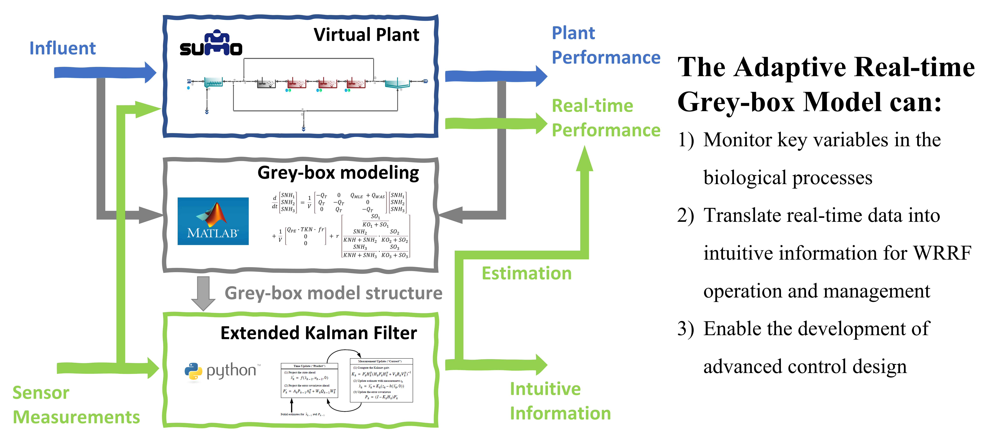

# An Adaptive Real-time Grey-box Model for Advanced Control and Operations in WRRFs

**Cheng Yang a, Peter Seiler b, Evangelia Belia c, Glen T. Daigger a,***

a Civil and Environmental Engineering, University of Michigan, 2350 Hayward St, G.G. Brown Building, Ann Arbor, MI 48109, US  
b Electrical Engineering and Computer Science, University of Michigan, 1301 Beal Avenue, EECS Building, Ann Arbor, MI 48109, US  
c Primodal Inc., 145 Rue Aberdeen, Quebec City, Quebec, CA

**ABSTRACT**
Grey-box models, which combine the explanatory power of first-principle models with the ability to detect subtle patterns from data, are
gaining increasing attention in wastewater sectors. Intuitive, simple structured but fit-for-purpose grey-box models that capture time-varying
dynamics by adaptively estimating parameters are desired for process optimization and control. As an example, this study presents the
identification of such a grey-box model structure and its further use by an Extended Kalman Filter (EKF), for the estimation of the nitrification
capacity and ammonia concentrations of a typical Modified Ludzack-Ettinger (MLE) process. The EKF was implemented and evaluated in real
time by interfacing Python with SUMO (Dynamita™), a widely used commercial process simulator. The EKF was able to accurately estimate
the ammonia concentrations in multiple tanks when given only the concentration in one of them. Besides, the nitrification capacity of the
system could be tracked in real time by the EKF, which provides intuitive information for facility managers and operators to monitor and
operate the system. Finally, the realization of EKF is critical to the development of future advance control, for instance, model predictive
control. Q3

**Key words**: activated sludge, extended Kalman filter, grey-box model, parameter estimation, SUMO

**Publication DOI:** 

**HIGHLIGHTS**

- The development of an adaptive real-time grey-box model with intuitive information is presented.

- The need of model adaptivity was identified and fulfilled by the Extended Kalman Filter.

- The extracted real-time intuitive information will help WRRFs staff in operations and management.

- Model structure simplicity and development pathway encourages applications for other processes. 

## Overview 
This repo provides the source code and implementation details of this paper, as mentioned in the supplementary material. 

### Contents 

> **Phase I - Greybox modeling** 
> > `Greybox_Scenario_Analysis.mlx `. This MATLAB live script consists of the whole procedure of the Phase I in the paper. 
> > > `MLETanks_1r.m` The non-linear grey box structure object needed for `nlgrest` in the MATLAB.Similar example could be found [here](https://www.mathworks.com/help/ident/ug/non-adiabatic-continuous-stirred-tank-reactor-matlab-file-modeling-with-simulations-in-simulink.html).  
> > > `prepare_iddata.m` convenient functions written and used for reading excel file and convert them into `iddata` object
> > > `display_input.m` & `eval_plot.m` convenient functions written and used in the `Greybox_Scenario_Analysis.mlx ` for processing and visualizing results.   

> **Phae II- Extended Kalman Filter** 
> 
> > `SUMO_EKF.ipynb` The python script used to implement the Phase II - with no changes in SRT and temperature 
> > 
> > `SUMO_EKF_SRT_drop.ipynb` The python script used to implement the Phase II - with SRT drop 
> > 
> > `SUMO_EKF_temp_drop.ipynb` The python script used to implement the Phase II - with temperature drop 
> > 
> > `SymbolicCalculation.ipynb` The python script used for symbolic calcuation, especially the jacobian used in the EKF 
> > 

> **Miscellaneous**
> 
> > `dynamita` The old Sumo-python API (version prior to the 2021)
> > 
> > `scenarioX.xlsx` The SUMO standard excel output for each scenarios. Note that the scenario 3 is a pure noise addtion to scenario 2 and is fullfiled directly in MATLAB.
> > 
> > **Python version**: 3.8.5
> > 
> > **SUMO version:** Sumo20(beta)
> > 
> > **Matlab version:** R2020a
> > 
